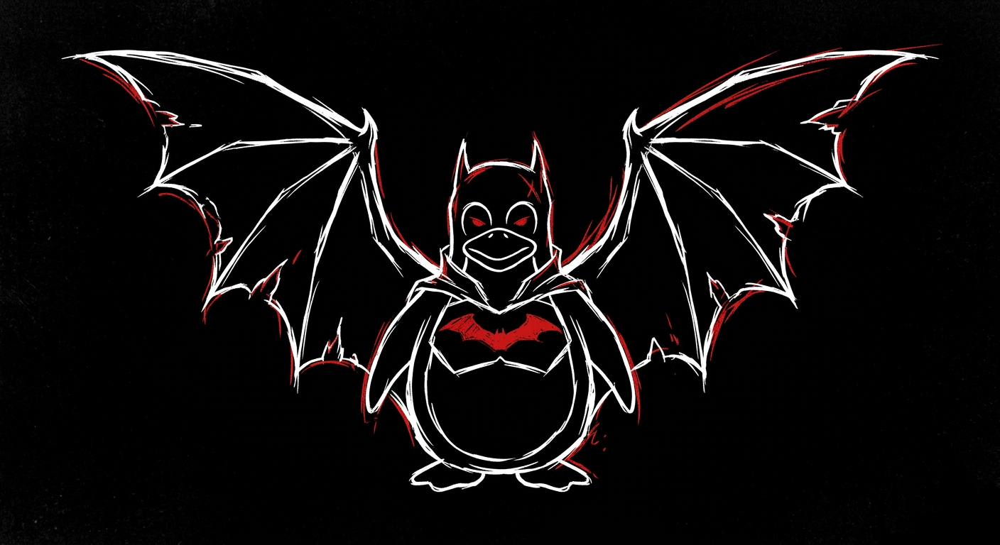
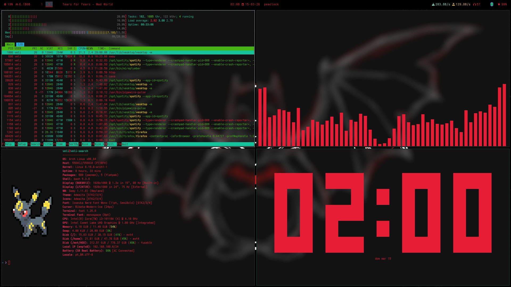

# 🔴 dotfiles

> Arch Linux · SwayFX · Waybar · Zsh · a minimalist setup with personality


---

---

## Overview

Productivity-focused setup with strong aesthetics — deep black, blood red (`#E71D36`), soft window blur, and Pokémon in the terminal. SwayFX as the Wayland compositor with visual effects, pill-style Waybar, and Zsh powered up with Oh My Zsh.

| |
| --- |
|  |

| | |
|---|---|
|  |    |


> The screenshot shows (clockwise from top-left): **htop**, **cava**, **peaclock**, and a terminal running **pokefetch**.

---

## Repository Structure

```
dotfiles/
├── .config/
│   ├── fastfetch/       # System fetch configuration
│   ├── foot/            # Foot terminal (native Wayland emulator)
│   ├── gtk-3.0/         # GTK3 theme
│   ├── gtk-4.0/         # GTK4 theme
│   ├── sway/            # SwayFX main config
│   └── waybar/
│       ├── config.jsonc     # Bar layout
│       ├── includes.json    # Module includes
│       ├── style.css        # Visual style
│       ├── modules/         # Individual Waybar modules
│       └── scripts/         # Helper scripts (e.g. spotify)
├── overview/            # Screenshots and setup photos
├── wallpapers/          # Wallpapers used in this setup
├── .zshrc               # Zsh + Oh My Zsh configuration
├── pokefetch.sh         # Pokémon + fastfetch terminal script
└── LICENSE.md
```

---

## Components

| Component | Tool |
|---|---|
| Compositor | [SwayFX](https://github.com/WillPower3309/swayfx) |
| Bar | [Waybar](https://github.com/Alexays/Waybar) |
| Terminal | [Foot](https://codeberg.org/dnkl/foot) |
| Shell | Zsh + [Oh My Zsh](https://ohmyz.sh/) |
| Launcher | [wmenu](https://git.sr.ht/~adnano/wmenu) |
| Fetch | [Fastfetch](https://github.com/fastfetch-cli/fastfetch) |
| Pokémon fetch | [pokeget](https://github.com/talwat/pokeget-rs) |
| Clipboard | [clipse](https://github.com/savedra1/clipse) |
| Screenshots | [grimshot](https://github.com/swaywm/sway/tree/master/contrib/grimshot) |
| Volume | PipeWire + PulseAudio (pactl / pavucontrol) |
| Brightness | [brightnessctl](https://github.com/Hummer12007/brightnessctl) |
| Bluetooth | [blueman](https://github.com/blueman-project/blueman) |
| Cursor | [Bibata-Modern-Ice](https://github.com/ful1e5/Bibata_Cursor) |
| Font | [Iosevka Nerd Font](https://www.nerdfonts.com/) |
| GTK Theme | Adwaita (dark) |

**Optional:**

| Component | Tool |
|---|---|
| Discord | [Vesktop](https://github.com/Vencord/Vesktop) |
| Music | [Spotify](https://archlinux.org/packages/extra/x86_64/spotify-launcher/) |

---

## Installation from Scratch

### 1. Arch Linux with archinstall

```bash
archinstall
```

Options to select:
- **Profile:** `minimal`
- **Audio:** `pipewire`
- Create a user with `sudo`

### 2. Post-install — system update

```bash
sudo pacman -Syu
```

### 3. Install yay (AUR helper)

```bash
sudo pacman -S --needed git base-devel
git clone https://aur.archlinux.org/yay.git
cd yay && makepkg -si
cd .. && rm -rf yay
```

### 4. Install official repository packages

```bash
sudo pacman -S \
  sway waybar foot \
  zsh git vim \
  fastfetch \
  pipewire pipewire-pulse wireplumber pavucontrol \
  brightnessctl \
  blueman \
  grim slurp \
  wmenu \
  playerctl \
  clipse \
  ttf-iosevka-nerd \
  noto-fonts noto-fonts-emoji \
  gtk3 gtk4 \
  xdg-utils xdg-user-dirs \
  htop cava
```

> **Note on SwayFX:** the official `sway` package doesn't have visual effects. Install `swayfx` from the AUR (step 5).

### 5. Install AUR packages

```bash
yay -S \
  swayfx \
  grimshot \
  pokeget-rs \
  bibata-cursor-theme \
  oh-my-zsh-git \
  zsh-autosuggestions \
  zsh-syntax-highlighting \
  zsh-autocomplete \
  zsh-autopair \
  zsh-you-should-use \
  fzf-tab \
  peaclock
```

### 6. Optional applications

These are included in the Sway autostart config. Install them if you want to use them, or remove their `exec` lines from `~/.config/sway/config`.

```bash
# Discord (Vencord)
yay -S vesktop

# Spotify
sudo pacman -S spotify
```

### 7. Clone this repository

```bash
git clone https://github.com/Mathesu-veLi/dotfiles.git ~/dotfiles
```

### 8. Copy the dotfiles

```bash
# .config files
cp -r ~/dotfiles/.config/* ~/.config/

# Zshrc
cp ~/dotfiles/.zshrc ~/

# pokefetch script (must be at $HOME, since .zshrc calls ./pokefetch.sh)
cp ~/dotfiles/pokefetch.sh ~/
chmod +x ~/pokefetch.sh
```

### 9. Set Zsh as default shell

```bash
chsh -s $(which zsh)
```

Close and reopen your terminal. Oh My Zsh will load on the next session.

### 10. Set your wallpaper

The wallpaper used in this setup (`batux-wallpaper.png`) is included in the `wallpapers/` folder. Copy it to your Pictures directory or any path you prefer:

```bash
cp ~/dotfiles/wallpapers/batux-wallpaper.png ~/Pictures/
```

Then update the path in `~/.config/sway/config`:

```
output * bg /home/YOUR_USERNAME/Pictures/batux-wallpaper.png fill
```

### 11. Configure your outputs (monitor)

Still in `~/.config/sway/config`, adjust resolution and position for your monitor(s):

```
output eDP-1 resolution 1920x1080 position 0 0 scale 1.3
```

Run `swaymsg -t get_outputs` to list your output names.

---

## Keybindings

The config keeps the [default sway keybindings](https://github.com/swaywm/sway/blob/master/config.in) and adds the following:

| Shortcut | Action |
|---|---|
| `$mod + Escape` | Terminate user session |
| `$mod + C` | Open clipboard manager (clipse) |
| `$mod + Shift + W` | Restart Waybar |
| `$mod + scroll up/down` | Switch workspace with mouse wheel |
| `$mod + P` | Screenshot of active window |
| `$mod + Shift + P` | Screenshot of selected area |
| `$mod + Alt + P` | Screenshot of entire output |
| `$mod + Ctrl + P` | Screenshot of focused window (window mode) |

---

## Waybar

The bar uses a **pill** layout, split into three groups on each side:

**Left:** CPU · RAM · Workspaces · Spotify  
**Center:** Clock · Active window title  
**Right:** Network · Volume · Tray · Battery

The Spotify module uses the `~/.config/waybar/scripts/waybar-spotify.sh` script + `playerctl`.

---

## Pokefetch

`pokefetch.sh` at `$HOME` runs automatically when a terminal is opened (called at the end of `.zshrc`). It picks a random Pokémon from the list and displays it alongside `fastfetch`.

> Script originally by [Discomanfulanito](https://github.com/Discomanfulanito/pokefetch/). The Pokémon list was customized to personal favorites.

Configured Pokémon: Charizard Mega X · Mimikyu Shiny · Mewtwo Mega Y · Umbreon · Gengar · Cubone · Groudon · Emboar · Snorlax

To add or remove Pokémon, edit the `POKEMON_LIST` array in `pokefetch.sh`. Run `pokeget --help` to see available names and flags.

> `pokeget` is installed from the AUR (`pokeget-rs`).

---

## Zsh Plugins

| Plugin | Purpose |
|---|---|
| `git` | Git aliases and integration |
| `you-should-use` | Reminds you when an alias exists for a command |
| `zsh-autosuggestions` | Suggests commands based on history |
| `zsh-syntax-highlighting` | Colorizes the command line in real time |
| `zsh-autocomplete` | Interactive autocomplete |
| `fzf-tab` | Replaces default tab completion with fzf |
| `zsh-autopair` | Auto-closes brackets, quotes, etc. |

---

## Visual Customization

### Main colors

| Usage | Hex |
|---|---|
| Foreground / Accent | `#E71D36` |
| Focused window border | `#16302B` |
| Waybar background | `#000000` |
| Focused workspace | `#353A47` |

### Font

**Iosevka Nerd Font Mono Semi-Bold** — used in the terminal and Waybar.

### Cursor

**Bibata-Modern-Ice** — size 24 (GTK) / 20 (Sway seat).

### Blur (SwayFX)

```
blur enable
blur_radius 3
blur_passes 3
```

### Gaps

```
gaps inner 5px
gaps outer 5px
smart_gaps inverse_outer
```

---

## Troubleshooting

**Waybar doesn't start:** check the log with `waybar 2>&1 | head -50`. Make sure all modules referenced in `config.jsonc` exist under `~/.config/waybar/modules/`.

**pokefetch doesn't run:** check if `pokeget` is installed (`which pokeget`) and if the script is executable (`chmod +x ~/pokefetch.sh`).

**Spotify doesn't go to the scratchpad:** the `app_id` for Spotify may vary. Check with `swaymsg -t get_tree | grep app_id` while Spotify is running.

**Font missing icons:** install `ttf-iosevka-nerd` and run `fc-cache -fv`.

**Cursor not applying in GTK apps:** make sure `~/.config/gtk-3.0/settings.ini` and `~/.config/gtk-4.0/settings.ini` are correct, then restart your applications.

---

## License

[Apache License 2.0](LICENSE.md)
